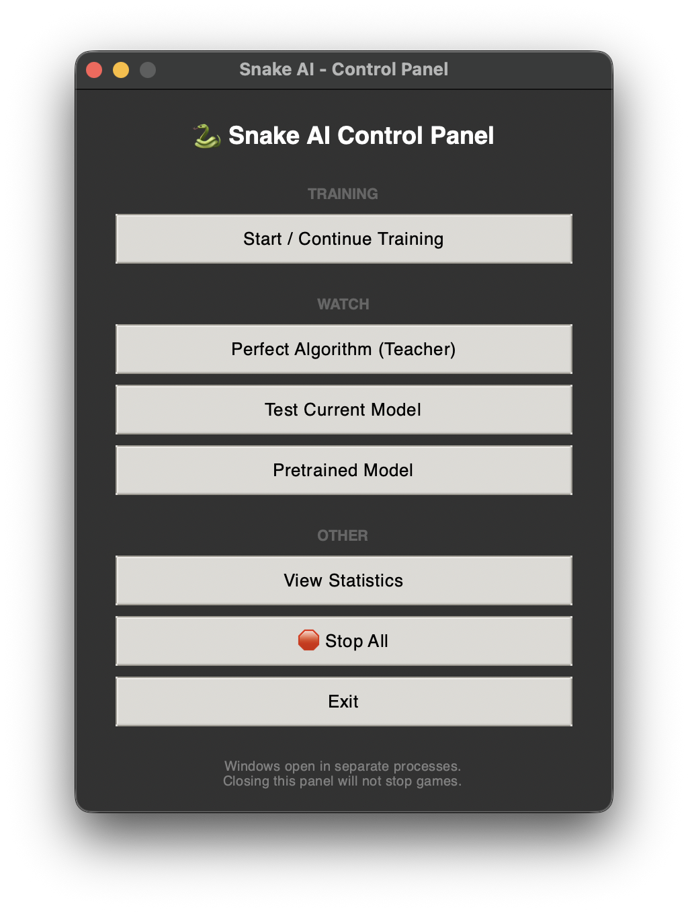
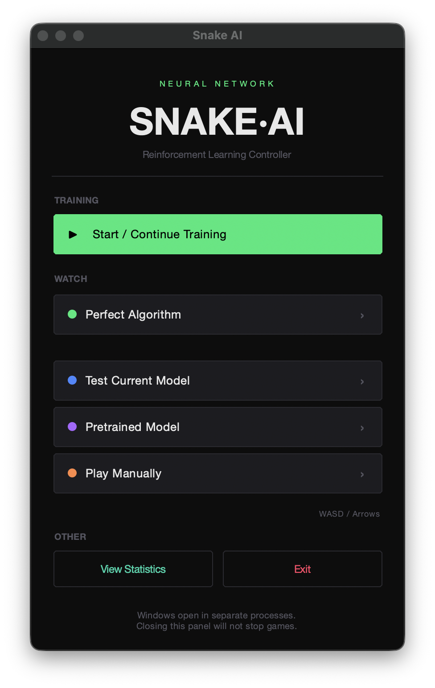
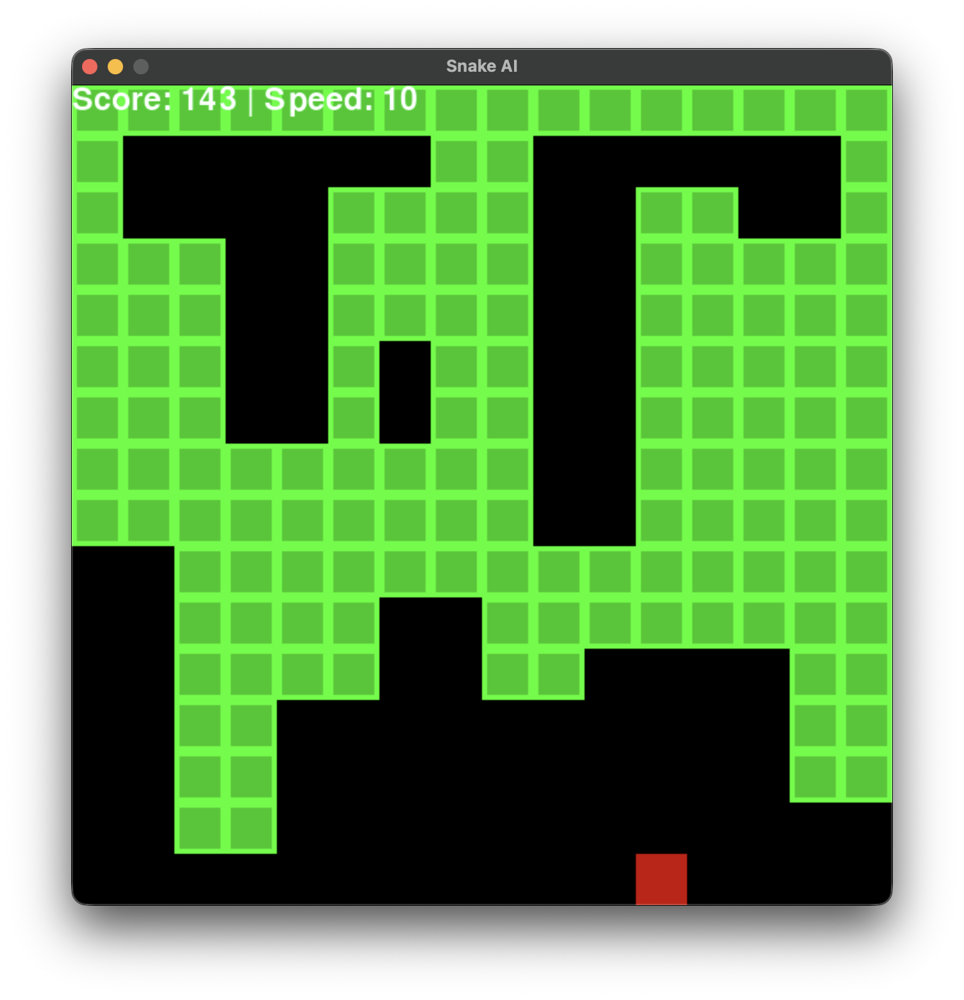
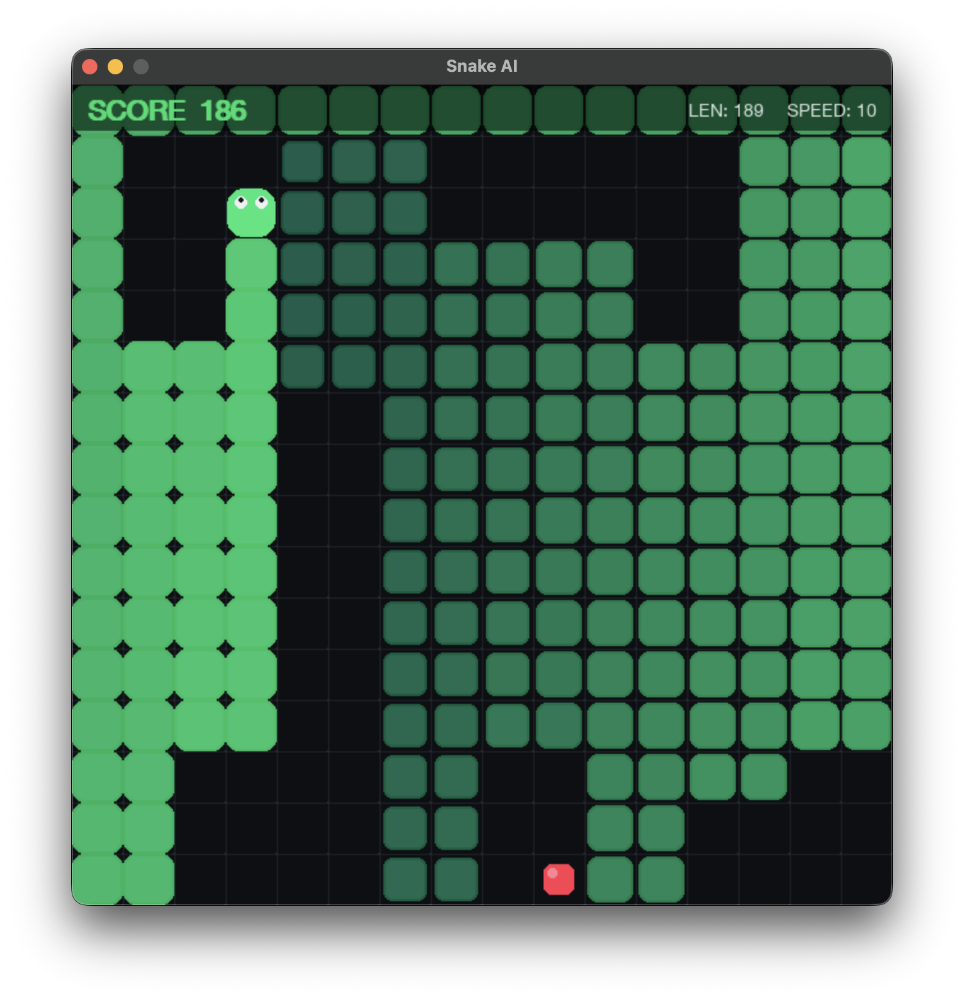

# 🐍 Snake AI

Среда Snake-игры с CNN-классификатором, обученным через **behavioral cloning + DAgger-lite** имитировать алгоритм совершенного **учителя на основе цикла Гамильтона**. Проект демонстрирует обучение по примерам (LfD) в чистом, практическом виде.

**Language:** [English](README.md) | [Русский](#русский)

---

## Русский

### Обзор

Проект обучает нейросеть играть в Snake, учась у экспертного алгоритма (учитель на основе цикла Гамильтона). Сеть учится:

- Навигировать по сетке 16×16 через относительные действия (прямо, направо, налево)
- Добираться до еды, избегая стен и собственного хвоста
- Использовать эгоцентричное представление состояния + компас для устойчивых решений

**Ключевые результаты:**

- **Лучший честный результат: 182.2 / 253** (72% от максимума)
- **Эталон учителя:** 253/253 постоянно
- Обучено ~275 играми с использованием 300k+ шагов DAgger-lite

### Возможности

- **Supervised learning, не reinforcement learning** — CrossEntropyLoss с метками учителя, без reward shaping
- **Curriculum DAgger-lite** — сеть видит свои ошибки через вероятностное возмущение политики
- **Curriculum старты** — агент встречает поздние состояния рано через длинные начальные змейки
- **Честная оценка** — отдельный цикл оценки без учителя (истинное умение)
- **Учитель на цикле Гамильтона** с сокращающими угол шагами (доказано безопасно)
- **Полная воспроизводимость** — включены обученная модель и логи обучения

### Галерея интерфейса (До / После)

**Стартовое окно**

| До | После (Premium Dark Theme) |
|:---:|:---:|
|  |  |

**Интерфейс игры**

| До | После (Modernized) |
|:---:|:---:|
|  |  |

**Тренировочная панель (Training Dashboard)**


### Как это работает

#### Представление состояния

9-канальный массив состояния (все нормализованы на [0, 1]):

- **Каналы 0–4 (эгоцентричные, повёрнутые):** голова, тело, еда, карта опасности (стены + тело), полнота поля
  - Повёрнуты так, чтобы голова всегда смотрела "вверх" (эгоцентричный вид)
- **Каналы 5–8 (абсолютные, не повёрнутые):** one-hot абсолютное направление (компас)
  - Позволяет сети различать повороты по абсолютной позиции на сетке, а не только локальным паттернам

#### Пространство действий

Относительно текущего направления: `[прямо, направо, налево]` (не абсолютные направления)

#### Учитель

`src/teacher.py`: Алгоритм на цикле Гамильтона, который:

1. Следует неподвижному циклу, посещающему все 256 клеток (серпантин + шоссе возврата)
2. Сокращает углы для быстрого добычи еды
3. Имеет две защиты, гарантирующие безопасность
4. Достигает 253/253 (100%) на стандартных и curriculum стартах

#### Цикл обучения

1. **Шаг:** Учитель вычисляет метку; сеть принимает действие (вероятностно — своё)
2. **Обучение:** Supervised loss (CrossEntropy) на метку учителя
3. **Оценка:** Каждые 25 игр — честная оценка (только сеть, без учителя)
4. **Чекпойнт:** Сохранить модель с лучшей оценкой

#### DAgger-lite и Curriculum

- **DAgger:** ~0–30% шагов используют действие сети (разогрев за 100k шагов), выявляя распределительный сдвиг
- **Curriculum:** После 150 игр, 20% эпизодов начинаются со змеек длиной 4–50 (поздние состояния)

### Результаты

**Прогресс обучения:**

- Игры 1–25: Честная оценка растёт с ~30 до ~60
- Игры 25–150: Оценка стабилизируется ~110–140, с колебаниями
- Игры 150–275: Оценка улучшается до **182.2**, достигая **253/253** в нескольких оценках

**Кривая обучения:** [assets/learning_curve.png](assets/learning_curve.png)

### Установка

#### Требования

- Python 3.8+
- Для `launcher.py`: Tkinter (включён на macOS/Windows; на Linux: `apt install python3-tk`)

#### Подготовка

```bash
# Клонировать репозиторий
git clone https://github.com/YOUR_USERNAME/SnakeAI_Project.git
cd SnakeAI_Project

# Создать виртуальное окружение (опционально, но рекомендуется)
python3 -m venv venv
source venv/bin/activate  # На Windows: venv\Scripts\activate

# Установить зависимости
pip install -r requirements.txt
```

**Примечание:** Проект использует минимальные зависимости: `torch`, `pygame`, `numpy`, `matplotlib`.

### Использование

#### 1. **Смотреть обученную модель**

```bash
python src/train_ai.py --watch --pretrained --games 5
```

Загрузить лучшую обученную модель и смотреть 5 игр (рекомендуется: сначала посмотрите результат).

#### 2. **Смотреть совершенный учителя**

```bash
python src/teacher.py
```

Запускает алгоритм цикла Гамильтона в реальном времени. Показывает 100% победы.

#### 3. **Обучить свою модель**

```bash
python src/train_ai.py
```

Начать обучение с нуля (или продолжить с `model/checkpoint_last.pth`, если существует).

- Ctrl+C для остановки
- Управление в игре: `+` ускорить, `-` замедлить, `0` максимум скорость

#### 4. **Тестировать текущую модель (без pretrained)**

```bash
python src/train_ai.py --watch --games 10
```

Загрузить лучший чекпойнт из своего обучения.

#### 5. **Панель управления Tkinter (все в одном)**

```bash
python launcher.py
```

Простой интерфейс для обучения, просмотра игр, статистики и остановки процессов.

#### 6. **Пользовательское количество игр**

```bash
python src/train_ai.py --watch --pretrained --games 25
```

### Структура проекта

| Файл | Назначение |
|------|-----------|
| `src/snake_game.py` | Двигатель игры (`SnakeGameAI`), константы сетки, цикл Гамильтона |
| `src/teacher.py` | Совершенный алгоритм цикла Гамильтона с сокращениями; демо |
| `src/train_ai.py` | Сеть (`SnakeNet`), буфер воспроизведения, тренер, агент, цикл обучения/оценки |
| `launcher.py` | Панель управления Tkinter для доступа ко всем функциям |
| `tools/record_demo.py` | Утилита для записи геймплея как анимированных GIF |

### Понимание кода

**Ключевые классы:**

- `SnakeGameAI` — Основной двигатель игры (состояние, столкновения, еда, сброс)
- `SnakeNet` — CNN классификатор (9→16→32→32→8192→128→3 logits)
- `Agent` — Обёртка сети с представлением состояния, выбором действия, сохранением
- `Trainer` — Adam оптимизатор + CrossEntropyLoss цикл обучения
- `ReplayBuffer` — Простой кольцевой буфер пар (состояние, действие)

**Ключевые функции:**

- `play_step(action)` — Один шаг игры; возвращает (game_over, score)
- `safe_moves()` — Вычисляет какие из 3 действий избегают столкновения
- `get_state(game)` — Строит 9-канальное состояние с поворотом и компасом
- `get_network_action(state, game)` — Forward pass + маска safe_moves
- `get_best_move(game)` — Логика учителя на цикле Гамильтона с сокращениями

### Кастомизация

**Гиперпараметры** (отредактируйте `src/train_ai.py`):

- `BATCH_SIZE` — Размер батча (по умолчанию 128)
- `LR` — Скорость обучения (по умолчанию 0.0005)
- `DAGGER_PROB_MAX` — Макс вероятность шагов сети (по умолчанию 0.7)
- `CURRICULUM_PROB` — Вероятность curriculum старта (по умолчанию 0.2)
- `EVAL_GAMES` — Игр на оценку (по умолчанию 15)

**Архитектура сети** (в `SnakeNet.__init__`):

- Модифицируйте каналы свёрток, размеры полносвязных слоёв и т.д.
- Вход: 9 каналов, выход: 3 logits (должны совпадать с пространством действий)

### Устранение проблем

**`model/pretrained.pth` не найден?**

- Файл включён в репо; если отсутствует, сеть обучает с нуля (случайная инициализация)

**Tkinter не установлен (Linux)?**

- Запустите: `apt install python3-tk`

**Окно игры зависает во время обучения?**

- Нормально — отрисовка задушена. Клавиши скорости всё ещё работают. Обучение идёт.

**Недостаточно памяти?**

- Уменьшите `MAX_MEMORY` (ёмкость буфера) в `src/train_ai.py`

### Лицензия

Проект выпущен под лицензией **MIT** — см. [LICENSE](LICENSE) для деталей.

### Благодарности

- Вдохновлено техниками behavioral cloning + DAgger из imitation learning
- Концепция цикла Гамильтона для детерминированной, безопасной навигации
- Построено на PyTorch, Pygame и NumPy

---

**Вопросы или вклад?** Открывайте issues или pull requests!
