<p align="center">
  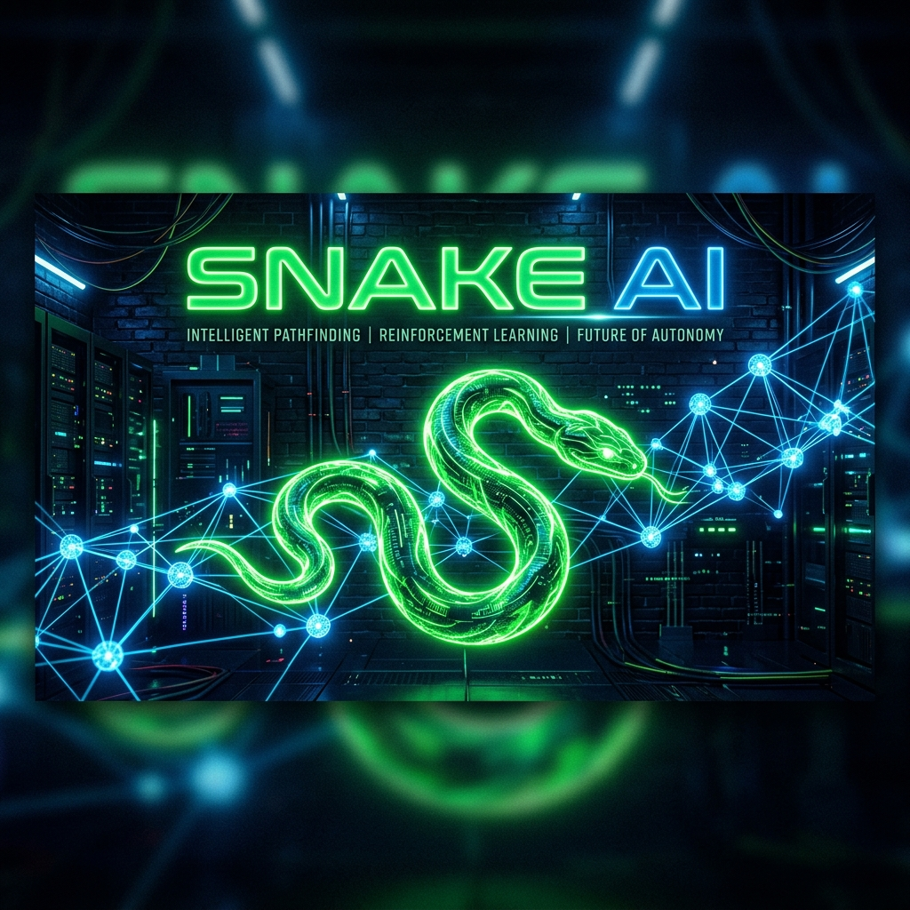
</p>

<p align="center">
  
  
  
  
  
  
  
</p>

<h1 align="center">🐍 Snake AI</h1>

<p align="center">
  <strong>Среда Snake-игры с CNN-классификатором, обученным через behavioral cloning + DAgger-lite имитировать алгоритм совершенного учителя на основе цикла Гамильтона.</strong><br>
  <em>Проект демонстрирует обучение по примерам (LfD) в чистом, практическом виде.</em>
</p>

<p align="center">
  <b>Language:</b> <a href="README.md">English</a> | <a href="#русский">Русский</a>
</p>

---

## Русский

### Содержание

- [Обзор](#обзор)
- [Демо](#демо)
- [Возможности](#возможности)
- [Галерея интерфейса](#галерея-интерфейса-до--после)
- [Как это работает](#как-это-работает)
- [Результаты](#результаты)
- [Установка](#установка)
- [Использование](#использование)
- [Структура проекта](#структура-проекта)
- [Понимание кода](#понимание-кода)
- [Кастомизация](#кастомизация)
- [Устранение проблем](#устранение-проблем)
- [Дальнейшие планы](#дальнейшие-планы-roadmap)
- [Лицензия](#лицензия)
- [Благодарности](#благодарности)

### Обзор

Проект обучает нейросеть играть в Snake, учась у экспертного алгоритма (учитель на основе цикла Гамильтона). Сеть учится:

- Навигировать по сетке 16×16 через относительные действия (прямо, направо, налево)
- Добираться до еды, избегая стен и собственного хвоста
- Использовать эгоцентричное представление состояния + компас для устойчивых решений

**Ключевые результаты:**

- **Лучший честный результат: 234.9 / 253** (93% от максимума)
- **Эталон учителя:** 253/253 постоянно
- Обучено ~350 играми с использованием 2.5M+ шагов DAgger-lite

### Демо

| Обученная модель (`pretrained.pth`) | Без обучения (случайная инициализация) |
|:---:|:---:|
| 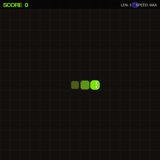 | 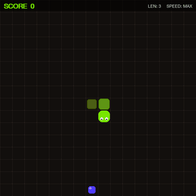 |

### Возможности

- **Supervised learning, не reinforcement learning** — CrossEntropyLoss с метками учителя, без reward shaping
- **Curriculum DAgger-lite** — сеть видит свои ошибки через вероятностное возмущение политики
- **Curriculum старты** — агент встречает поздние состояния рано через длинные начальные змейки
- **Честная оценка** — отдельный цикл оценки без учителя (истинное умение)
- **Учитель на цикле Гамильтона** с сокращающими угол шагами (доказано безопасно)
- **Полная воспроизводимость** — включены обученная модель и логи обучения
- **Подбор гиперпараметров и бенчмарк** — CLI-флаги (`--lr`, `--dagger-prob-max`, `--curriculum-prob`, `--run-name`) для изолированных, сравнимых запусков, плюс `tools/benchmark.py` для сравнения чекпойнтов друг с другом
- **Tauri-приложение** — автономный GUI (`app/`) с живыми графиками обучения, четырьмя панелями (Train / Watch AI / Benchmark / Models) и управлением процессами; Python не нужен конечному пользователю

### Галерея интерфейса (До / После)

**Стартовое окно**

| До | После (Premium Dark Theme) |
|:---:|:---:|
| 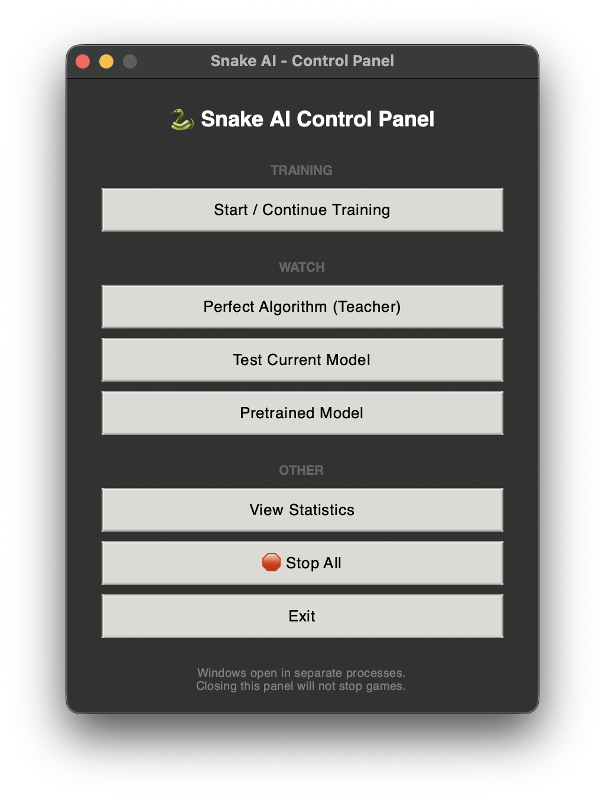 | 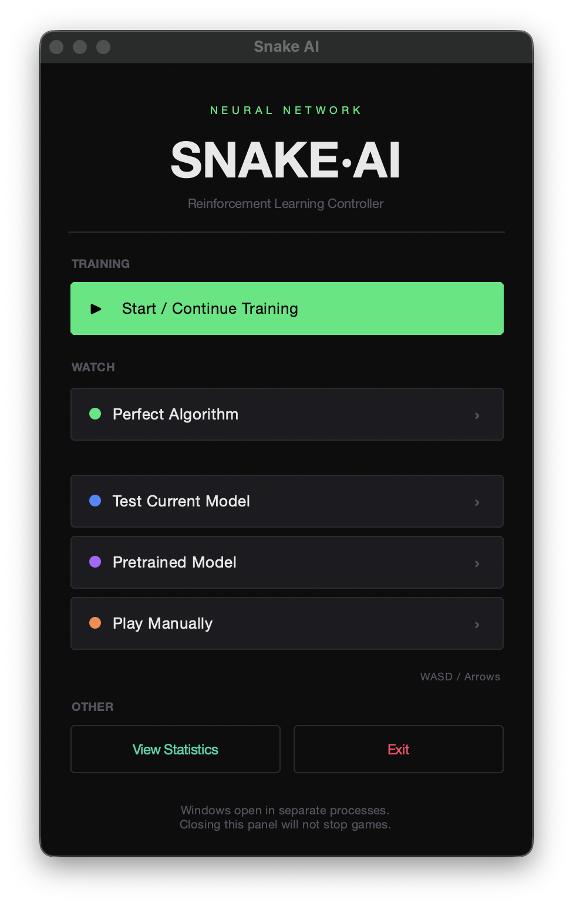 |

**Интерфейс игры**

| До | После (Modernized) |
|:---:|:---:|
| 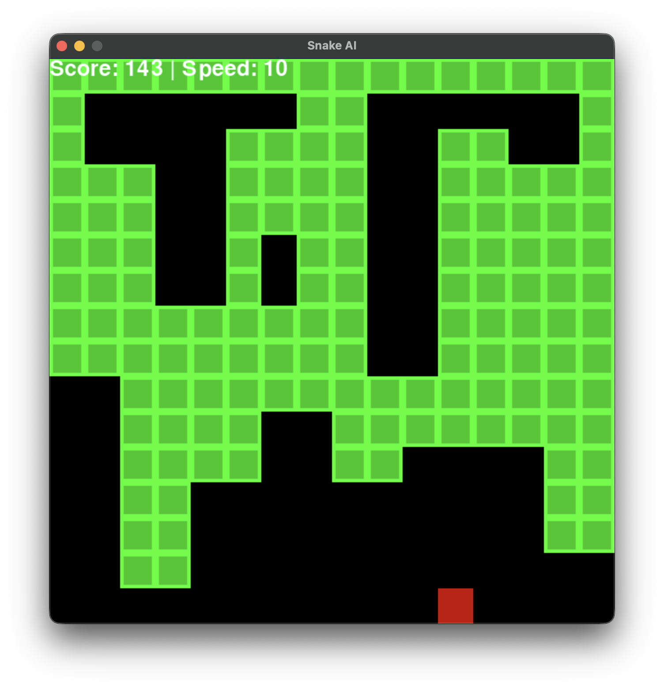 | 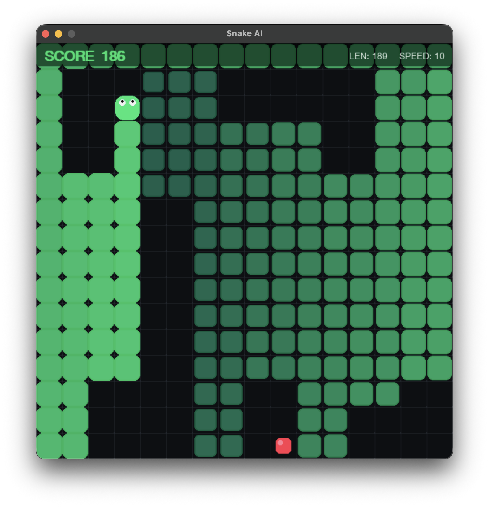 |

**MVP Tauri-приложения (Desktop App)**
<br>
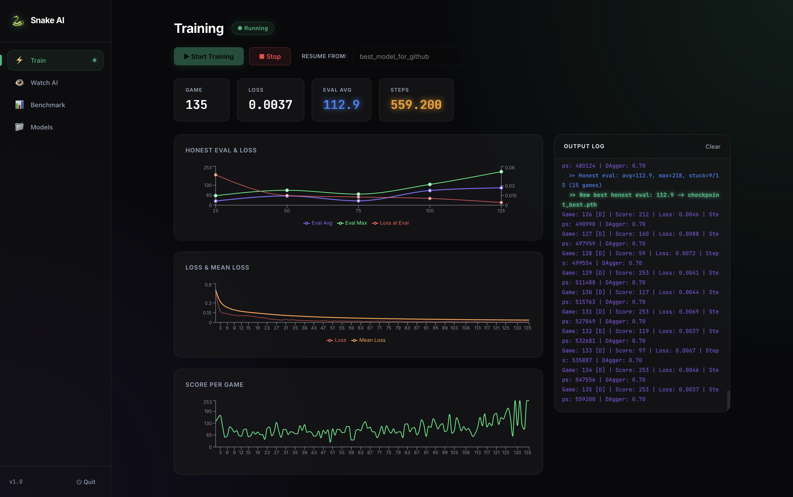
<br>
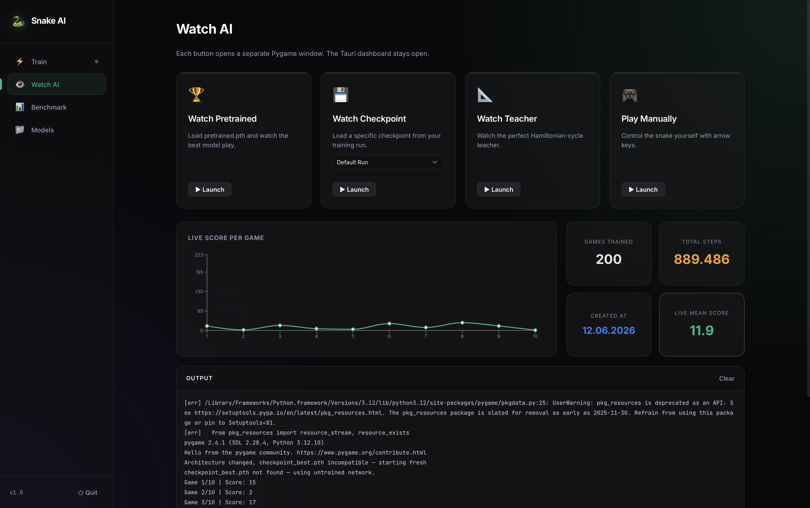
<br>
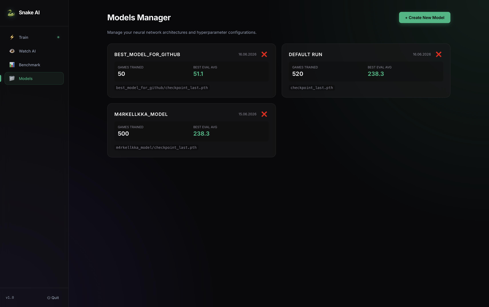

### Как это работает

#### Представление состояния

10-канальный массив состояния (все нормализованы на [0, 1]):

- **Каналы 0–5 (эгоцентричные, повёрнутые):** голова, тело, еда, карта опасности (стены + тело), полнота поля, история посещений
  - Повёрнуты так, чтобы голова всегда смотрела "вверх" (эгоцентричный вид)
  - Канал 5 (история посещений): бинарная карта позиций головы с момента последнего яблока — помогает детектировать петли
- **Каналы 6–9 (абсолютные, не повёрнутые):** one-hot абсолютное направление (компас)
  - Позволяет сети различать повороты по абсолютной позиции на сетке, а не только локальным паттернам

#### Пространство действий

Относительно текущего направления: `[прямо, направо, налево]` (не абсолютные направления)

#### Учитель

`src/teacher.py`: Алгоритм на цикле Гамильтона, который:

1. Следует неподвижному циклу, посещающему все 256 клеток (серпантин + шоссе возврата)
2. Сокращает углы для быстрого добычи еды
3. Имеет две защиты, гарантирующие безопасность
4. Достигает 253/253 (100%) на стандартных и curriculum стартах

#### Цикл обучения

1. **Шаг:** Учитель вычисляет метку; сеть принимает действие (вероятностно — своё)
2. **Обучение:** Supervised loss (CrossEntropy) на метку учителя
3. **Оценка:** Каждые 25 игр — честная оценка (только сеть, без учителя)
4. **Чекпойнт:** Сохранить модель с лучшей оценкой

#### DAgger-lite и Curriculum

- **DAgger:** ~0–30% шагов используют действие сети (разогрев за 100k шагов), выявляя распределительный сдвиг
- **Curriculum:** После 150 игр, 20% эпизодов начинаются со змеек длиной 4–50 (поздние состояния)

#### Схема пайплайна

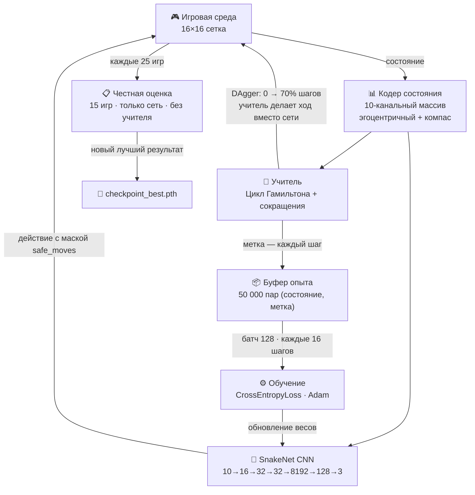
```mermaid
flowchart TD
    ENV["🎮 Игровая среда\n16×16 сетка"] -->|состояние| ST["📊 Кодер состояния\n10-канальный массив\nэгоцентричный + компас"]
    ST --> T["📐 Учитель\nЦикл Гамильтона + сокращения"]
    ST --> N["🧠 SnakeNet CNN\n10→16→32→32→8192→128→3"]
    T -->|"метка — каждый шаг"| BUF["📦 Буфер опыта\n50 000 пар (состояние, метка)"]
    T -->|"DAgger: 0 → 70% шагов\nучитель делает ход вместо сети"| ENV
    N -->|"действие с маской safe_moves"| ENV
    BUF -->|"батч 128 · каждые 16 шагов"| TR["⚙️ Обучение\nCrossEntropyLoss · Adam"]
    TR -->|"обновление весов"| N
    ENV -->|"каждые 25 игр"| EV["📋 Честная оценка\n15 игр · только сеть · без учителя"]
    EV -->|"новый лучший результат"| CK["💾 checkpoint_best.pth"]
```

### Результаты

**Прогресс обучения:**

- Игры 1–150: Честная оценка растёт неравномерно с ~34 до ~134, с провалом до ~48 около игры 125
- Игры 150–350: Дальнейший (волатильный) рост, с пиком **234.9 / 253** (93%) на игре 350
- Игры 350–450: Колебания в диапазоне ~185–216 — "залипание" в петле на части полей в
  позднем эндшпиле не даёт честной оценке стабильно достичь идеальных 253; подробности о том,
  почему именно пиковый чекпойнт (`checkpoint_best.pth`), а не последний
  (`checkpoint_last.pth`), стал `pretrained.pth`, см. в заметках в коде

**Кривая обучения:** [assets/learning_curve.png](assets/learning_curve.png)

**Бенчмарк (100 игр, seed 42, `pretrained.pth`):**

| Режим | Среднее | Медиана | Std | Мин | Макс | Win rate (253/253) | Stuck rate |
|------|------|--------|-----|-----|-----|---------------------|------------|
| С "unstick" (по умолчанию) | 226.0 | 253.0 | 56.9 | 45 | 253 | 81% | 0% |
| Без "unstick" (`--no-unstick`, чистая сеть) | 206.0 | 253.0 | 70.4 | 36 | 253 | 67% | 13% |

"Unstick" — это страховка: если сеть повторяет петлю `(голова, направление)`, этот шаг
передаётся учителю. Она почти полностью убирает зависания в петле (13% → 0%) и поднимает
среднюю оценку на ~20 пунктов. Запустить самостоятельно: `tools/benchmark.py` (см. [Использование](#использование)).

### Установка

#### Требования

- Python 3.8+
- Для `launcher.py` (legacy): Tkinter (включён на macOS/Windows; на Linux: `apt install python3-tk`)
- Для Tauri-приложения (`app/`): [Node.js](https://nodejs.org) ≥ 18 и [Rust](https://rustup.rs) (`cargo` / Tauri CLI)

#### Подготовка

```bash
# Клонировать репозиторий
git clone https://github.com/m4rkellkka/SnakeAI_Project.git
cd SnakeAI_Project

# Создать виртуальное окружение (опционально, но рекомендуется)
python3 -m venv venv
source venv/bin/activate  # На Windows: venv\Scripts\activate

# Установить зависимости
pip install -r requirements.txt
```

**Примечание:** Проект использует минимальные зависимости: `torch`, `pygame`, `numpy`, `matplotlib`.

### Использование

#### 1. **Смотреть обученную модель**

```bash
python src/train_ai.py --watch --pretrained --games 5
```

Загрузить лучшую обученную модель и смотреть 5 игр (рекомендуется: сначала посмотрите результат).

#### 2. **Смотреть совершенного учителя**

```bash
python src/teacher.py
```

Запускает алгоритм цикла Гамильтона в реальном времени. Показывает 100% победы.

#### 3. **Обучить свою модель**

```bash
python src/train_ai.py
```

Начать обучение с нуля (или продолжить с `model/checkpoint_last.pth`, если существует).

- Ctrl+C для остановки
- Управление в игре: `+` ускорить, `-` замедлить, `0` максимум скорость

#### 4. **Тестировать текущую модель (без pretrained)**

```bash
python src/train_ai.py --watch --games 10
```

Загрузить лучший чекпойнт из своего обучения.

#### 5. **Tauri-приложение (рекомендуемый GUI)**

```bash
cd app
npm install        # только при первом запуске
npm run tauri dev  # dev-режим с горячей перезагрузкой
# или: npm run tauri build  →  нативный .app / инсталлятор
```

Полнофункциональная тёмная панель управления с четырьмя панелями:

- **Train** — запуск/остановка обучения, живые графики score + eval, цветной лог
- **Watch AI** — кнопки для pretrained-модели, своего чекпойнта, учителя или ручной игры (каждая открывает Pygame-окно)
- **Benchmark** — N игр с настройкой чекпойнта/seed/unstick
- **Models** — список именованных runs, графики истории обучения, создание новых sweep-запусков с кастомными LR / DAgger prob / curriculum prob

#### 6. **Панель управления Tkinter (Legacy)**

```bash
python launcher.py
```

Простая альтернатива — работает без дополнительных зависимостей, кроме Python + Tkinter.

#### 7. **Пользовательское количество игр**

```bash
python src/train_ai.py --watch --pretrained --games 25
```

#### 8. **Запуск с подбором гиперпараметров (sweep)**

```bash
python src/train_ai.py --headless --run-name sweep_lr0.001 \
    --lr 0.001 --dagger-prob-max 0.5 --curriculum-prob 0.3
```

Переопределяет `LR`, `DAGGER_PROB_MAX` или `CURRICULUM_PROB` для одного запуска. `--run-name` изолирует чекпойнты и `learning_curve.png` в `model/<run-name>/`, чтобы sweep-запуски не перезатирали друг друга или основной прогон — каждый чекпойнт также хранит свой `run_config` для трассировки. Или создайте именованный run через панель **Models** в Tauri-приложении.

#### 9. **Бенчмарк чекпойнтов**

```bash
python tools/benchmark.py --checkpoint checkpoint_best.pth \
    --checkpoint sweep_lr0.001/checkpoint_best.pth \
    --games 100 --seed 42 --plot benchmark.png
```

Прогоняет N игр на каждый чекпойнт и выдаёт полное распределение score (mean/median/std/перцентили/win rate) плюс сравнительную таблицу — более точный сигнал, чем просто avg/max. Либо используйте панель **Benchmark Models** в `launcher.py`.

### Структура проекта

| Файл / Директория | Назначение |
| ----------------- | ---------- |
| `src/snake_game.py` | Двигатель игры (`SnakeGameAI`), константы сетки, цикл Гамильтона |
| `src/teacher.py` | Совершенный алгоритм цикла Гамильтона с сокращениями; демо |
| `src/train_ai.py` | Сеть (`SnakeNet`), буфер воспроизведения, тренер, агент, цикл обучения/оценки |
| `src/play_manual.py` | Ручная игра в Snake (WASD / стрелки), то же Pygame-окно |
| `src/export_history.py` | Читает чекпойнт и выгружает историю обучения в JSON — используется панелью Models в Tauri |
| `app/` | Tauri v2 приложение (React 19 frontend + Rust backend) — полная GUI-панель управления |
| `launcher.py` | Legacy-панель управления Tkinter |
| `tools/record_demo.py` | Утилита для записи геймплея как анимированных GIF |
| `tools/benchmark.py` | Бенчмарк-харнесс — прогоняет N игр на чекпойнт, выдаёт распределение score и сравнение |

### Понимание кода

**Ключевые классы:**

- `SnakeGameAI` — Основной двигатель игры (состояние, столкновения, еда, сброс)
- `SnakeNet` — CNN классификатор (10→16→32→32→8192→128→3 logits)
- `Agent` — Обёртка сети с представлением состояния, выбором действия, сохранением
- `Trainer` — Adam оптимизатор + CrossEntropyLoss цикл обучения
- `ReplayBuffer` — Простой кольцевой буфер пар (состояние, действие)

**Ключевые функции:**

- `play_step(action)` — Один шаг игры; возвращает (game_over, score)
- `safe_moves()` — Вычисляет какие из 3 действий избегают столкновения
- `get_state(game)` — Строит 9-канальное состояние с поворотом и компасом
- `get_network_action(state, game)` — Forward pass + маска safe_moves
- `get_best_move(game)` — Логика учителя на цикле Гамильтона с сокращениями

### Кастомизация

**Гиперпараметры** (отредактируйте `src/train_ai.py`):

- `BATCH_SIZE` — Размер батча (по умолчанию 128)
- `LR` — Скорость обучения (по умолчанию 0.0005)
- `DAGGER_PROB_MAX` — Макс вероятность шагов сети (по умолчанию 0.7)
- `CURRICULUM_PROB` — Вероятность curriculum старта (по умолчанию 0.2)
- `EVAL_GAMES` — Игр на оценку (по умолчанию 15)

**Архитектура сети** (в `SnakeNet.__init__`):

- Модифицируйте каналы свёрток, размеры полносвязных слоёв и т.д.
- Вход: 9 каналов, выход: 3 logits (должны совпадать с пространством действий)

### Устранение проблем

**`model/pretrained.pth` не найден?**

- Файл включён в репо; если отсутствует, сеть обучает с нуля (случайная инициализация)

**Tkinter не установлен (Linux)?**

- Запустите: `apt install python3-tk`

**Окно игры зависает во время обучения?**

- Нормально — отрисовка задушена. Клавиши скорости всё ещё работают. Обучение идёт.

**Недостаточно памяти?**

- Уменьшите `MAX_MEMORY` (ёмкость буфера) в `src/train_ai.py`

### Дальнейшие планы (Roadmap)

#### 🚀 Версия 1.0 (Текущая)

Базовая версия с поведенческим клонированием завершена. Ключевые результаты:

- ✅ **Tauri-приложение** — тёмная GUI-панель с живыми графиками обучения, панелями Train/Watch AI/Benchmark/Models и управлением процессами
- ✅ **Документация** — оглавление, Mermaid-диаграмма пайплайна, двуязычные README
- ✅ **Подбор гиперпараметров** — именованные runs, CLI-флаги, изолированные чекпойнты с трассировкой `run_config`
- ✅ **Инструменты бенчмарка** — полное распределение score, сравнение чекпойнтов с фиксированным seed
- ✅ **Честная оценка** — отдельный eval-цикл без учителя, отслеживание stuck-rate, сохранение лучшего чекпойнта
- **Standalone-инсталлятор** (бандлинг Python через sidecar) — отложено на будущий релиз

#### 🧠 Версия 2.0 (Новые методы обучения)
После v1.0 фокус сместится на совершенно новые парадигмы обучения, помимо имитационного.
- **Обучение с подкреплением (RL)** — Реализовать DQN/PPO с нуля (`src/train_rl.py`), добавив обертку наград без изменения API среды.
- **Multi-snake окружение** — Обобщить поле на N змеек (столкновения друг с другом, общая еда).
- **Self-play / AI vs AI** — Агенты, обучающиеся при игре друг против друга в новом окружении.
- **Ensemble Benchmarking** — Прямое сравнение моделей BC, RL и self-play.
- **Препятствия и кастомные поля** — Так как учитель на цикле Гамильтона не умеет обходить случайные препятствия, эту задачу будут решать RL-агенты.

#### 🎮 Будущие расширения
- **Режим Человек vs AI** — Расширить `play_manual.py` на multi-snake окружение.
- **Вкладка Турнир/Лидерборд** — Выбирать чекпойнты/режимы, прогонять через benchmark harness и показывать таблицу результатов в Tauri-приложении.
- **Эксперименты с архитектурой сети** — Residual blocks, более глубокие свертки и альтернативные размеры FC для `SnakeNet`.

### Лицензия

Проект выпущен под лицензией **MIT** — см. [LICENSE](LICENSE) для деталей.

### Благодарности

- Вдохновлено техниками behavioral cloning + DAgger из imitation learning
- Концепция цикла Гамильтона для детерминированной, безопасной навигации
- Построено на PyTorch, Pygame и NumPy

---

**Вопросы или вклад?** Открывайте issues или pull requests!
